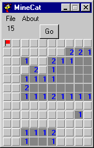



## MineCat

### Description

This is a MineSweeper clone, made a day I was bored. Fully functional and commented! The game algorythm might interest some people. If not, just drag-and-drop to your trashcan ;-)

PS:If someone knows another algorythm for it, I'd be interested...
 
### More Info
 

             |
---                |---
**Submitted On**   |2001-06-11 10:51:48
**By**             |[Chris Gillent](https://github.com/Planet-Source-Code/PSCIndex/blob/master/ByAuthor/chris-gillent.md)
**Level**          |Intermediate
**User Rating**    |5.0 (15 globes from 3 users)
**Compatibility**  |VB 5\.0, VB 6\.0
**Category**       |[Games](https://github.com/Planet-Source-Code/PSCIndex/blob/master/ByCategory/games__1-38.md)
**World**          |[Visual Basic](https://github.com/Planet-Source-Code/PSCIndex/blob/master/ByWorld/visual-basic.md)
**Archive File**   |[MineCat209926112001\.zip](https://github.com/Planet-Source-Code/chris-gillent-minecat__1-23984/archive/master.zip)

